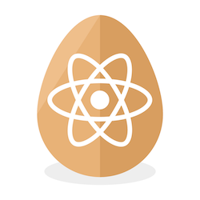

# react-seed-component [](https://travis-ci.org/hourliert/react-component-seed)

This project is a generic react component. It comes with a playground where you can test it.
All the build process is handled by [builder-react-comp](https://github.com/olivierkastel/builder-react-comp).

## Getting started

first, clone the projet on your workspace :

```
git clone ssh://git@git.wid.la:10022/wid/react-seed-component.git
```

To start the playground, simply run:


```
cd react-seed-component
npm install
npm start
```

The playground has **react-hot-reload** so you can edit your component and see the result in real time.

## Developing your component

### Edit package.json

Right after cloning the new component, edit info in the package.json. You have to change :

* `name` : Name of the component package. It should be this format : quiver-componentname (exemple: quiver-loading-button...) This is the name you will use to import your component in a react project (example : import LoadingButton from 'quiver-loading-button').
* `version` : Set the version of the component.
* `description` : Choose a simple description for your component.

### Start Coding

The component's source code is located in `./src`. By default, the component's name is 'TableWrapper'. You should should make a global find and replace and change 'TableWrapper' with the name you want.

Also, do not forget to rename:

* `src/TableWrapper.js` with your component's name and don't forget to change the class name in it.
* `src/TableWrapper.example` with your component's name.

That's it, your ready to build your component !

### Installing open source components

You can use any npm components. Just install them using the following command :

```
npm install --save componentName
```

## Publish your component

When your component is working fine, it is time to publish it on Github. Then you will be able to install it on every react project using NPM.

To prepare the project for Github, run the following command in the project's folder :

```
npm run build
```

Create a new repo on Github on react-quiver : https://github.com/React-Quiver.

## Use your component in a react project
To install the component in a react project, run the following command :

```
npm install --save #github-link#
```

Npm will install all require dependencies. Import the component and you're done !

```js
import LoadingButton from 'quiver-loadingButton';
```

## Project structure
* `./src`: Source code
* `./src/__tests__/`: Test code
* `./playground`: Playground source code
* `./types`: Additionnal typescript definition files

## Tasks
* `npm start`: Start the playground and compile the component on file change
* `npm test`: Run all component tests in **jest**
* `npm run lint`: Lint the code of the component
* `npm run tdd`: Run all component tests in watch mode
* `npm run release -- -- semverComptaibleString`: Create a new component version.
